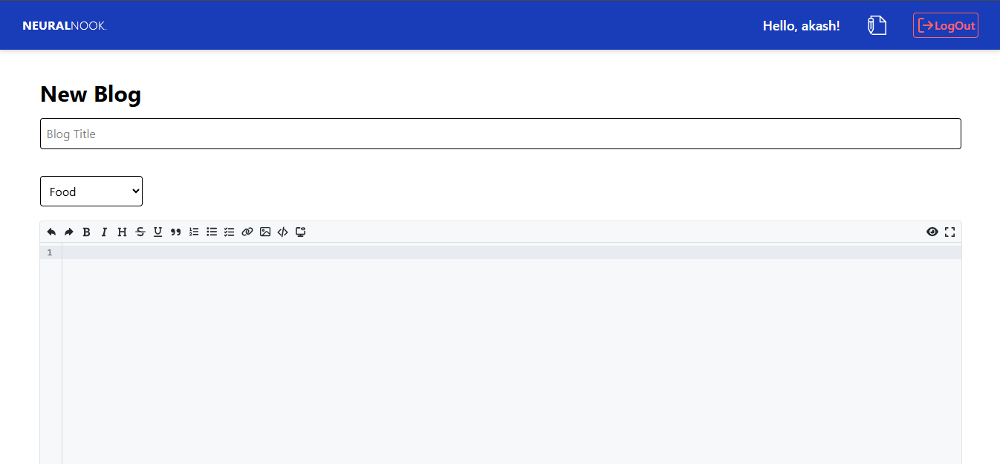
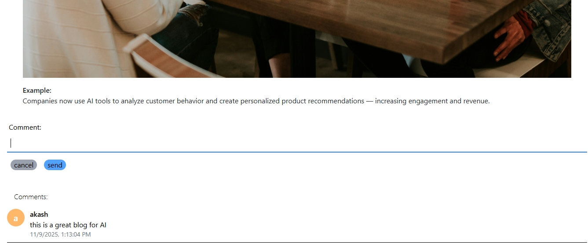

# 📝 NeuralNook..

A **full-stack blogging platform** built using **ReactJS**, **TailwindCSS**, **NodeJS**, **ExpressJS**, and **MongoDB**.  
This project allows users to **create, read, update, and comment on blogs** with secure **JWT authentication** and **MD5 encryption**.

---

##  Features

- **User Authentication**
  - Register and Login functionality
  - JWT token-based authentication
  - Passwords encrypted using **MD5**

- **Blog Management**
  - Create, Read, Update, Delete, and Publish blogs
  - Option to save a blog as **Draft**
  - Only logged-in users can create or edit blogs

- **Comment System**
  - Logged-in users can comment on blogs
  - Non-registered users can only view blogs

- **Access Control**
  - Public users → Can only **read blogs**
  - Registered users → Can **create, update, and comment**

---

## 🛠️ Tech Stack

| Area | Technology Used |
|------|------------------|
| Frontend | ReactJS, TailwindCSS |
| Backend | NodeJS, ExpressJS |
| Database | MongoDB |
| Authentication | JWT (JSON Web Token) |
| Encryption | MD5 Algorithm |

---

## ⚙️ Installation and Setup

Follow the steps below to run this project locally:

### 1️⃣ Clone the repository
```bash
git clone https://github.com/AKashAMode/NeuralNook.git
cd blogging-website


2️⃣ Install dependencies
For frontend:
cd client
npm install

For backend:
cd server
npm install

3️⃣ Setup environment variables

Create a .env file in your server folder and add:

MONGO_URI=your_mongodb_connection_string
JWT_SECRET=your_secret_key
PORT=5000

4️⃣ Run the project
Start backend server:
npm run server

Start frontend:
npm run dev


Now the app will start on:

Frontend → http://localhost:5173  
Backend → http://localhost:5000

🏠 Home Page


🔐 Login / Register Page


📝 Create Blog Page


📖 Blog View Page


💬 Comment Section


📂 Folder Structure
blogging-website/
│
├── client/                 # Frontend (React + Tailwind)
│   ├── src/
│   ├── public/
│   └── package.json
│
├── server/                 # Backend (Node + Express)
│   ├── controllers/
│   ├── models/
│   ├── routes/
│   ├── server.js
│   └── package.json
│
├
│
└── README.md

🔒 Security and Authentication

JWT (JSON Web Token) → Used for secure user sessions.

MD5 Algorithm → Used to encrypt passwords during registration/login.

🤝 Contributing

Contributions are welcome!
Feel free to fork this repository, make improvements, and submit a pull request.

📧 Contact

Author: Akash Amode
📩 Email: akashamode80@gmail.com

💻 GitHub: https://github.com/AKashAMode
